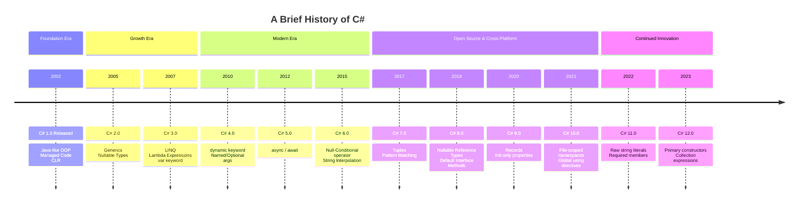

Excellent. Knowing the history of C# isn't just about trivia; it shows you *why* the language is designed the way it is, helping you understand its features and philosophy more deeply.

### **The History of C#: A Journey of Modernization**

Here is a timeline of the key milestones in the evolution of C#:

### **The Deeper Story: Eras and Philosophies**

#### **1. The Birth: The Java Rival (Early 2000s)**

*   **The Project:** Code-named **"Cool"** (C-like Object Oriented Language).
*   **The Lead Architect:** **Anders Hejlsberg**, a renowned engineer who also created Turbo Pascal and Delphi. He was hired by Microsoft for this very purpose.
*   **The Goal:** To create a modern, component-oriented, object-oriented language for the new **.NET Framework**. It was positioned as a direct competitor to Java, offering similar simplicity and garbage collection but with more modern features from the start (like properties vs. getter/setter methods).
*   **C# 1.0 (2002):** The foundation was solid but simple. It contained the core OOP features: classes, interfaces, events, properties, and managed code.

#### **2. The Establishment: Finding its Voice (Mid 2000s)**

*   **C# 2.0 (2005):** This was a **massive** leap forward. Its killer feature was **Generics** (``List<T>``, ``Dictionary<K, V>``), which were implemented at the runtime level for performance and type safety, unlike Java's compiler-level implementation. This showed C# was serious about performance and strong typing.
*   **C# 3.0 (2007):** Arguably the most important release ever. It introduced a suite of features that fundamentally changed how developers wrote code:
    *   **LINQ (Language Integrated Query):** A revolutionary way to query data from any source (collections, databases, XML) in a consistent, SQL-like syntax.
    *   **Lambda Expressions** (`x => x * x`): The backbone of LINQ and a huge boost for functional programming techniques.
    *   **The `var` Keyword,** Anonymous Types, Auto-Properties, and Object Initializers.
    *   **This release cemented C#'s identity:** a multi-paradigm language that embraced both object-oriented and functional styles.

#### **3. The Maturation: Modernization and Interop (2010-2015)**

*   **C# 4.0 (2010):** Focused on interoperability and easing specific pain points.
    *   **`dynamic` keyword:** For easier interaction with dynamic languages like Python or COM objects (e.g., Excel automation).
    *   **Named and Optional Arguments:** Improved readability and flexibility in method calls.
*   **C# 5.0 (2012):** The **"Asynchronous"** release. Its flagship feature was the **`async` and `await`** keywords. This simplified asynchronous programming immensely, making complex, non-blocking code almost as easy to write as synchronous code. This was critical for modern, responsive applications.

#### **4. The Open-Source Renaissance: Cross-Platform and Rapid Innovation (2015-Present)**

This era began with the dramatic shift to open-source and cross-platform with **.NET Core**.

*   **C# 6.0 (2015):** A release focused on **"cleaner code"** with many small, quality-of-life improvements:
    *   Null-Conditional operator (`?.`)
    *   String Interpolation (`$"Hello, {name}"`)
    *   Expression-bodied members (`public string Name => _name;`)
*   **C# 7.0 (2017):** Continued the push for functional programming and more concise code.
    *   **Tuples** for lightweight, unnamed types.
    *   **Pattern Matching** (the start of a very important journey for the language).
    *   `out` variable declarations.
*   **C# 8.0 (2019):** A major release alongside .NET Core 3.0.
    *   **Nullable Reference Types:** A groundbreaking feature to help eliminate `NullReferenceException` by making nullability an explicit part of the type system. This showed a deep commitment to robustness.
    *   **Default Interface Methods:** Allowing interfaces to have implementation details, enabling safer API evolution.
*   **C# 9.0 (2020):** The "records" release.
    *   **Records** (`public record Person(string Name, int Age);`): For creating immutable types with value-based equality by default. A huge win for functional programming and data models.
*   **C# 10.0 (2021), 11.0 (2022), 12.0 (2023):** These releases have continued the theme of making code more concise, performant, and robust.
    *   **File-scoped namespaces,** **Global `using` directives,** **Required members,** **Raw string literals,** **Primary constructors,** and **Collection expressions.**

